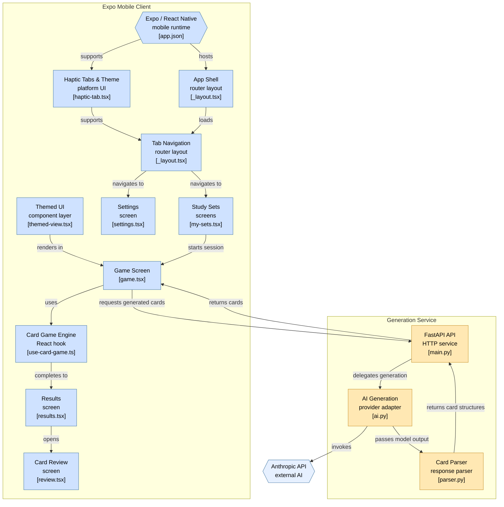

[README.md](https://github.com/user-attachments/files/32345146/README.md)
# headsup-study

A mobile study app that turns your notes into a party game. Upload vocab terms — as text, a photo, or a PDF — and it will auto-generates flashcards you can quiz yourself on solo or play "Heads Up!" style with tilt controls. First entry in a planned series of study-focused party games.

## Features

- **AI flashcard generation** - paste text, snap a photo of notes, or upload a PDF (typed or scanned) and the backend extracts terms and definitions automatically via the Anthropic API
- **Heads-up game mode** - tilt your phone forward to pass, tilt back to mark a card correct, all against a countdown timer
- **Review mode** - untimed flip-card review with "got it" / "still learning" tracking, and a "review missed" loop to drill weak spots
- **Saved sets** - flashcard sets persist locally so you can replay or review them later
- **Configurable settings** - adjustable timer length and cards-per-round
- **Cross-platform** - built with Expo, so it runs on iOS, Android, and web from one codebase

## Tech Stack

| Layer | Technology |
|---|---|
| Mobile client | React Native, Expo, Expo Router |
| Backend | Python, FastAPI |
| AI generation | Anthropic API (Claude) |
| PDF/image parsing | pdfplumber, PyMuPDF, Pillow |
| Local storage | AsyncStorage |
| Sensors | expo-sensors (accelerometer for tilt controls) |

## Architecture



## Getting Started

### Prerequisites

- Node.js and npm
- Python 3.10+
- An Anthropic API key

### Backend (`server/`)

```bash
cd server
pip install -r requirements.txt
```

Create a `.env` file with your API key:

```
ANTHROPIC_API_KEY=your_key_here
```

Run the server:

```bash
uvicorn main:app --reload --host 0.0.0.0
```

### Frontend (`client/`)

```bash
cd client
npm install
npx expo start
```

Point the client at your backend's IP/port, then open the app in a development build, an emulator, or Expo Go.

## Project Structure

<details>
<summary>Click to expand</summary>

```
jordonspage-headsup-study/
├── README.md
├── client/
│   ├── README.md
│   ├── app.json
│   ├── eslint.config.js
│   ├── frontend.code-workspace
│   ├── package.json
│   ├── tsconfig.json
│   ├── app/
│   │   ├── _layout.tsx
│   │   ├── explore.tsx
│   │   ├── game.tsx
│   │   ├── modal.tsx
│   │   ├── my-sets.tsx
│   │   ├── results.tsx
│   │   ├── review.tsx
│   │   ├── settings.tsx
│   │   └── (tabs)/
│   │       ├── _layout.tsx
│   │       ├── explore.tsx
│   │       └── index.tsx
│   ├── components/
│   │   ├── external-link.tsx
│   │   ├── haptic-tab.tsx
│   │   ├── hello-wave.tsx
│   │   ├── parallax-scroll-view.tsx
│   │   ├── themed-text.tsx
│   │   ├── themed-view.tsx
│   │   └── ui/
│   │       ├── collapsible.tsx
│   │       ├── icon-symbol.ios.tsx
│   │       └── icon-symbol.tsx
│   ├── constants/
│   │   └── theme.ts
│   └── hooks/
│       ├── use-card-game.ts
│       ├── use-color-scheme.ts
│       ├── use-color-scheme.web.ts
│       └── use-theme-color.ts
├── server/
│   ├── ai.py
│   ├── main.py
│   └── parser.py
└── .claude/
    └── settings.local.json
```

</details>

## Roadmap

This is the first entry in a planned series of study-focused party games — future additions may include more game modes and multiplayer support.
