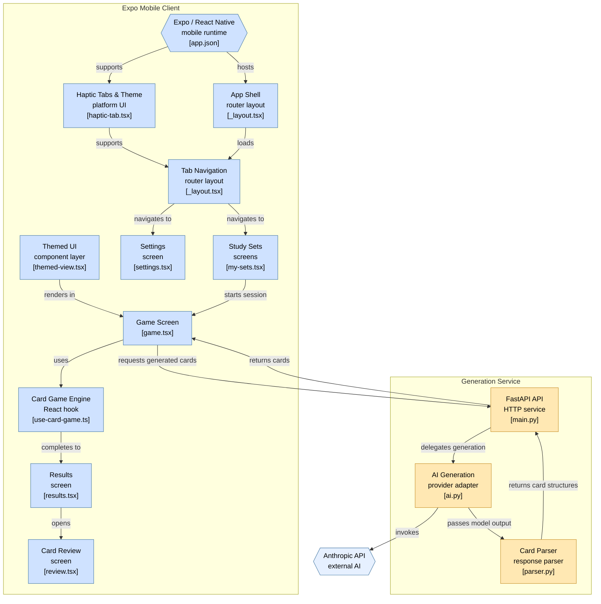

# headsup-study

Soon to be series of multiple party games centered around studying
# Stack
ReactNative  
Expo 
Python
FastAPI
Anthropic API
full-stack mobile app with React Native frontend and FastAPI backend served over a live IP
Integrated Anthropic API to auto-generate flashcards from user-inputted vocab terms
Implemented accelerometer-based tilt controls and real-time game logic for interactive study sessions

[architecture.md](https://github.com/user-attachments/files/32344676/architecture.md)

